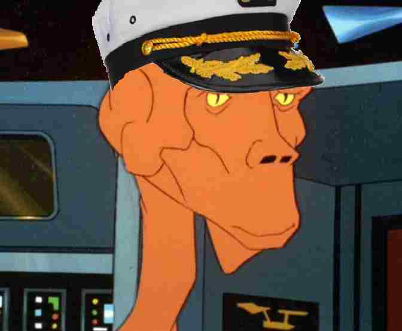
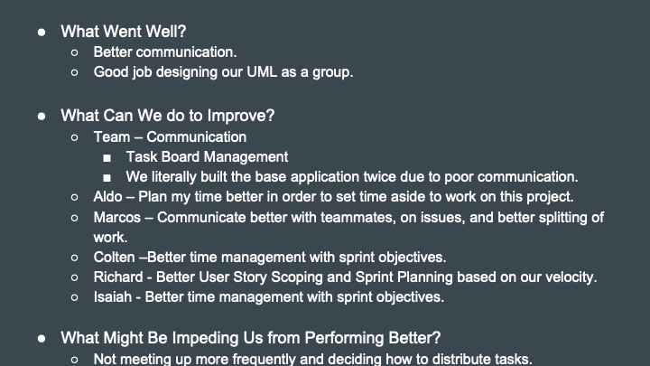
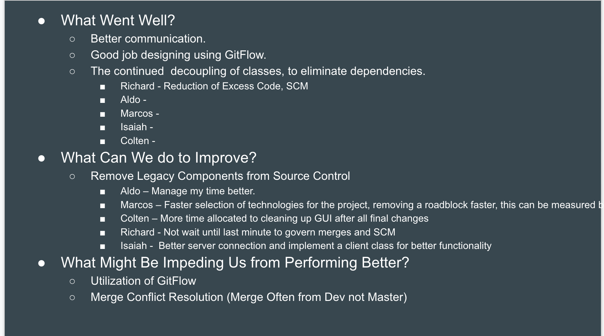

# CS3398-Edosians-S2020
# Battle Boats
> Battle Boats is a multiplayer online game inspired by Battleship.

## Table of contents
* [General info](#general-info)
* [Screenshots](#screenshots)
* [Technologies](#technologies)
* [Setup](#setup)
* [Features](#features)
* [Status](#status)
* [Inspiration](#inspiration)
* [Contact](#contact)

## General info
Created by Colten Murray, Aldo Garcia Tovar, Isaiah Collins, Marcos Izaquirre Manet and Richard Hale, Battle Boats is a multiplayer
turn-based strategy game inspired by the popular board game Battleship. As per traditional Battleship rules player begin the game by
setting up ships on their individual sides of the game board. Once both sides are finished, the game begins and players take turns attacking the opposite side trying to hit an enemy ship. In our version of the game, the player will be able to move their ships inbetween turns depending on the ship's class. Also, differing ship classes will have individual ways in how they can attack the opposite side. The first player to lose all their ship loses! Our audience is anyone interested in killing some time with classic gameplay familiar to all age generations. Our goal is to recreate battleship into a more interactive version that is easier to play with your friends and hopefully capture some of the success experienced by other board game inspired web apps such as skribble.io, slither.io, and words with friends.

## Screenshots

## Technologies
* To be decided
* Javascript

## Setup
Describe how to install / setup your local environement / add link to demo version.

## Features
List of features ready and TODOs for future development
* Data Object Design for Board, Player Configuration, Event - Developer architecture for objects and events that make up the game
* Object Database Storage - Developer Storage architecture for the objects and events that make up the game
* API Design, Methods for Starting a game and session, and Fire Events - Developer architecture and design for eventing and service management
* Component for Game Board Generation - Board obstacle generation to provide unique gameplay for users
* GUI Front Framework - User GUI for locating or creating game sessions.
* Player Login - Simple user login for game session creation and custom username.
* Game Assignment (Pattern) - Online gameplay where two users are assigned to a shared gameboard
* Game Board Piece Placement (Pattern) - User placement of game pieces and the ability to control movement of the pieces
* Player Attack Notification - Ability for user's to attack their opponents
* Opponent Attack Response Notification - Ability for the user to be attacked by their opponent

To-do list:
* Design data objects for board and players.
* Design database to hold objects during gameplay
* Design API for game sessions
* Design Obstacle generation
* Design GUI.
* Design game rules and gameplay

## Status
Project is in progress.
As of sprint 1, we have a working demo that allows for one player gameplay.

Team members status
Aldo - Finished the boats game board pieces. Next step is to add the pieces to the game.
Marcos - Implemented queue system with checkpoints. Next step involves planning and and making a
working queue for players to queue into and a better player class.
Richard - created the initial shell project with client server and multiple screens

-----------------------------------------------------------------------
SPRINT 1 - Single Player POC Game

-----------------------------------------------------------------------
SPRINT 2 - Images and Completion of JavaFX Game Client

## Inspiration
Project inspired by Battleship. This is our semester project for Software Engineering Spring 2020.

## Contact
Created by Aldo Garcia, Colten Murray, Marcos Izaguirre, Isaiah Collins, and Richard Hale.
